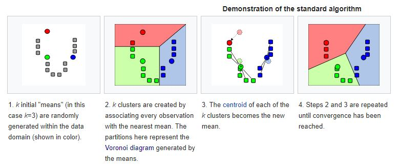
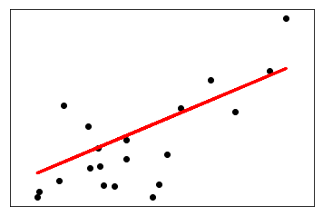
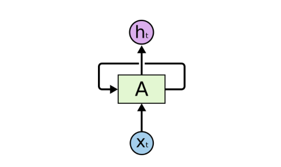
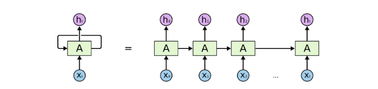

# FantaCode Training

This is the repository for updating training programs learned as an intern at FantaCode Solutions.


##### Beginner's Game

Beginner's game is a RPG game with no class or inheritance implementations. It simply uses if-else conditions to match a user input to the specified set of inputs.

## First Week 

### Intermediate RPG

Intermediate RPG is an implementation of OOP concepts in python. It uses classes and functions to create a mini text based RPG.

## Second Week

### Data Analysis and Prediction

Analysed, wrangled, cleansed and predicted the data on [Titanic Machine Learning from Disaster](https://www.kaggle.com/c/titanic) using Jupyter Notebook.

I tried to implement a [sample notebook solution](https://www.kaggle.com/startupsci/titanic-data-science-solutions/notebook) for the Titanic competition on Kaggle. I learned many things while completing the full implementation. Some of them are:
 - Read csv file to python using Pandas DataFrame
 - Visualize related data in the dataframe using Seaborn and matplotlib
 - Create incomplete data in the dataframe
 - Combining relatively dependent data
 - Dividing continuous numeric data into ranges and then assigning values to each range
 - Mapping discrete non numeric values into discrete numeric values
 - Used multiple predictive modelling algorithms to study which algorithm gives better accuracy for our data


## Third Week

#### Tasks for Third Week

Learn the basics of Machine Learning and implement it in Scikit Learn
 - [x] K-means Clustering
 - [x] Linear Regression
 - [x] Logistic Regression


 ##### K-means Clustering

 K-means Clustering is when there are a number of means in a plane and we want to add some points to each cluster, according to the distances to these means. But when the points get added to the clusters, the mean of the cluster gets dislocated. So we will again cluster them according to the distances to the mean. This process is repeated till there will not be any change in the means (centroids).

 


 In this work, I'm trying to implement K-means clustering on Handwritten digits data. The project was inspired from [this scikit-learn example](http://scikit-learn.org/stable/auto_examples/cluster/plot_kmeans_digits.html).

The data it uses is from Scikit Learn datasets

The clustering performance were evaluated with these metrics:
- Adjusted Rand Index (ARI)
- Adjusted Mutual Information (AMI)
- Homogeneity score
- Completeness score
- V-measure
- Silhouette coefficient

All those metrics have their own aspects.

We evaluate different initialization strategies for K-means using these metrics.
After evaluating, we visualize the Cluster using meshgrid in numpy. 


#### Regression Analysis

Regression analysis is a set of statistical methods used to estimate relationships between the variables. This is mostly used to find correlation between independent and dependant variables.

##### Linear Regression

Linear Regression is a regression model where we relate an dependent variable to one or more independant variables. We use this in machine learning to predict numerical value of some indepedent value corresponding to dependent variables. 

For the training, I implemented Linear Regression using an [example in scikit-learn.org](http://scikit-learn.org/stable/auto_examples/linear_model/plot_ols.html#sphx-glr-auto-examples-linear-model-plot-ols-py) in a [jupyter notebook](Third%20Week/LinearRegressionExample.ipynb)

The dataset used in this file is the 'diabetes' dataset that comes with the sklearn.datasets, imported using ```from sklearn.datasets import load_diabetes```. The last 20 values were taken to test the regression and got a variance score of `.41`. The output was plotted using ```matplotlib.pyplot.scatter```. 

The output is as shown below: 




##### Logistic Regression

Logistic regression is a regression model, which helps to relate dependent variable to independent variables where the dependent variables are categorical. It means that the output will be discrete values. When one refers to 'Logistic Regression', he is referring to the binary logistic regression, where there will be only 2 outputs, '1' or '0' (binary). 

The main difference among Linear regression and Logistic regression is that when Linear regression produces an output numerals in an infinite range, Logistic regression results in binary values. This is specifically suitable to many applications. We can use Linear regression where logistic regression are applicable, but it is not efficient. Logistic regression's efficiency comes from it's cross-entropy error function instead of least squares.

For the training, I implemented a [jupyter notebook](Third%20Week/LogisticRegression_Affairs.ipynb) inspired by a [classification of finding affairs in women](http://nbviewer.jupyter.org/gist/justmarkham/6d5c061ca5aee67c4316471f8c2ae976).


The dataset was collected from a survey conducted by Redbook magazine. The data had information like age, occupation, number of children, how they rated their married life, husband's occupation, number of extramarital affairs, letc. Information like education and occupation were already assigned values according to each categories, so data cleansing was not necessary here. First the data was preprocessed and prepared. Then the data was visualised to see how some dependents held up against the affair value. After that the data was fitted to the logistic regression model with the necessary data. Then the model was used to predict for some arguments and ran some evaluation metrics. The model turned out to be 73% accurate for predicting if a woman have affairs with the given data.


## Week Four

#### Tasks for Forth Week

- Learn flask and create an API for all the algorithms implemented in Scikit learn.

Dividing the task into two:

- [x] Learn about the Flask framework
- [x] Create an API for Logistic Regression

##### Flask 

Flask is a micro web framework written in Python. It is based on Werkzeug toolkit and Jinja2 template engine. The main features of Flask are:

- Contains development server and debugger
- Integrated support for unit testing
- RESTful request dispatching
- Uses Jinja2 templating
- Support for secure cookies (client side sessions)
- 100% WSGI 1.0 compliant
- Unicode-based
- Extensive documentation
- Google App Engine compatibility
- Extensions available to enhance features desired


The Flask was used to implement [an API](Week%20Four/Iris/IrisAPI.py) for logistic regression. The API took in json requests and produced the predictio
n output as return of the API. A sample input and output of the API is given below:

###### Input:

```json
[
  [
        5.5,
        4.2,
        1.4,
        0.2
    ],
    [
        7.3,
        2.9,
        6.3,
        1.8
    ],
    [
        6.0,
        2.2,
        4.0,
        1.0
    ]
]
```

###### Output:
```json
{
    "prediction": [
        0,
        2,
        1
    ]
}
```

The API contains two methods, `predict` and `train`. The method `predict` is a 'POST' method and `train` is a 'GET' method.


## Week Five

#### Tasks for Fifth Week

 - [x] Learn intermediate machine learning concepts like Neural Networks
 - [x] Learn basics of Keras and implement a neural network in Keras.

 ##### Neural Networks

 Artificial Neural Networks are computation models which imitate the biological neural networks, present in the brains.
 In a neural network, there will be several neurons or units which transmits data from one layer to another and creating 
 connection with other neurons. These neurons create weights for each neuron and the weights suggest how to process an input.

 There may be a single layer or multiple layers hidden in a neural network. The more layers there, the better will be the 
 network to predict later on, but it will take more processing power to train the network for each iteration. Neural networks 
 are mostly used in the areas of Visual Recognition, Speech processing, gaming bots, etc. 

 ##### Keras

 Keras is an open-sourced deep neural network library. Here I've created a neural network to predict the diabetes using 
 a dataset. The neural network was influenced from [an example found on MachineLearningMastery.com](https://machinelearningmastery.com/tutorial-first-neural-network-python-keras/).

 I implemented the example in a [python file](Week%20Five/keras-network.py) and in a [jupyter notebook file](Week%20Five/keras_network.ipynb) 
 to compare the prediction model with the dataset. The prediction was very fine (8 errors in 77 test data). 

 ## Week Six

 #### Tasks for Sixth Week

 - [x] Learn to work with text datasets.
 - [x] Learn to implement an LSTM  and seq-seq model in Keras.
 - [x] **Project** : Create a language modelling LSTM in Keras.

 ##### Word Embeddings

 A recent breakthrough in the field of natural language processing is called word embedding.

This is a technique where words are encoded as real-valued vectors in a high-dimensional space, where the similarity between words in terms of meaning translates to closeness in the vector space.
Which means if two words are very similar in meaning, they would be very close in the vector space.
Discrete words are mapped to vectors of continuous numbers. This is useful when working with natural language problems with neural networks and deep learning models are we require numbers as input.


I implemented two jupyter notebooks, both in which I use imdb review dataset to train models. These data are already embedded
into numerical values, so no further embedding is required. Although I've embedded to form a dataset with a vocabolary size of 5000.
One [jupyter notebook](Week%20Six/Text%20Training/MLPmodel_imdb.ipynb) uses a simple Multi-Layer Perceptron model to process
the imdb dataset. The other [jupyter notebook](Week%20Six/Text%20Training/CNNmodel_imdb.ipynb) uses a 1-Dimensional Convolutional
Neural Network Model. Both the works were inspired from [a tutorial on MachineLearningMastery.com](https://machinelearningmastery.com/predict-sentiment-movie-reviews-using-deep-learning/).

A CNN is usually used to train an image classifier. CNNs were designed to process the spatial structure in image data.
They are good at learning to recognize objects in images and find the position of each object. These characteristics of CNN
is helpful to learn the structure in paragraphs of words.

An interesting fact I learned is that using more epochs doesn't correspond to more accuracy in a CNN. I once ran the CNN
 with 10 epochs instead of 2 epochs. The accuracy dropped from 86.94% (using 2 epochs) to 86.88% (using 10 epochs). 

 ##### Recurrent Neural Networks

 A RNN has loops in them that allow infromation to be carried across neurons while reading in input.

 *Structure of a simple RNN:*

 

*Unrolled Structure of a RNN:*



Theoretically RNNs can handle context from the beginning of the sentence which will allow more accurate predictions of 
a word at the end of a sentence. In practice this isn’t necessarily true for vanilla RNNs. This is a major reason why 
RNNs faded out from practice for a while until some great results were achieved with using a Long Short Term Memory(LSTM)
 unit inside the Neural Network. Adding the LSTM to the network is like adding a memory unit that can remember context 
 from the very beggining of the input.

 ##### Long Short Term Memory networks (LSTM)

 Long Short Term Memory networks – usually just called “LSTMs” – are a special kind of RNN, capable of learning long-term
  dependencies. They were introduced by Hochreiter & Schmidhuber (1997), and were refined and popularized by many people 
  in following work.1 They work tremendously well on a large variety of problems, and are now widely used.

LSTMs are explicitly designed to avoid the long-term dependency problem. Remembering information for long periods of time
 is practically their default behavior, not something they struggle to learn!

All recurrent neural networks have the form of a chain of repeating modules of neural network. In standard RNNs, this 
repeating module will have a very simple structure, such as a single tanh layer.

*Structure of a LSTM network:*


Some of the variants of LSTM are : 

- LSTM with 'peephole connections', introduced by [Gers & Schmidhuber (2000)](ftp://ftp.idsia.ch/pub/juergen/TimeCount-IJCNN2000.pdf)
- LSTM with coupled forget and input gates
- Gated Recurrent Unit (GRU)


I implemented a [jupyter notebook](Week%20Six/LSTM/TextGen_LSTM.ipynb) with LSTM RNN by training data using 'Alice's Adventures in Wonderland' story from [Project Gutenberg](http://www.gutenberg.org/cache/epub/11/pg11.txt).
The model took about 17 minutes to pass 1 epoch. Here's a sample output I got with 20 epochs:

>Seed:
>"  from her as hard as it could go, and making quite a commotion in
>the pool as it went.
>so she calle "

>d to ter whate whe world oadt to the woile oa then and toen a getd wan a lootne oo the tait, and the war not in the bane and the sabbit sat sh the tabte oi the gad nerer here the was so toe thee  the was not in the bane and the sabbit sat sh the tabte oi the garter was no the tine the was soenk again, and the whrt here toiee the whrt wall to the woide the was so tone the was so toye 
>the had nov oo the taate of the war so toenk ano hor hoa to the tooe of the garter, and was solniig an inr an she wooke. and tae toei it har hnat the white rabbit was soe oant of the whrt of the garter, and whs wored toen it tas an anl oo the toie. ‘ho wou den to you do wou hane to tea that iave a can! io wou den’ wouhd the want on an inrssns,’
>‘h woode than to ae a cetd wail to,’ said alice, ‘aod the mors oi the garter wouh a cian winh i sai soene the wante  and the world bale wait in she bane and the sare whth the same th thi white rase in and toen a gett wanlee of the woide oo the wan hoon the tas so t


 ## Week Seven

 #### Tasks for Seventh Week

 - [x] Work with Facebook’s Babi Dataset and Experiment with different models like LSTM, MANN to improve accuracy on it.

  I used the Facebook's bAbI dataset to train and test a model, which takes in certain statements of a number of personnel's
  activities (only limited vocabulary here), and then see the result using a couple of statements predict using the model.
  The task was done in [this python file](Week%20Seven/bAbI_completed.py). 


## Module Ten

### Task

- [x] Implement contextual Chatbot in Keras.
- [ ] Project - Add Contextual Features to the News Bot Created in previous
      week’s project.

I implemented a chatbot using [gunthercox-corpus](https://github.com/gunthercox/chatterbot-corpus) dataset and used the GloVe word encoding to improve the performance. To see the chatbot in action, run [chatbot.py](Module%20Ten/chatbot.py) and to train the model, run [train_chatbot.py](Module%20Ten/train_chatbot.py). 


